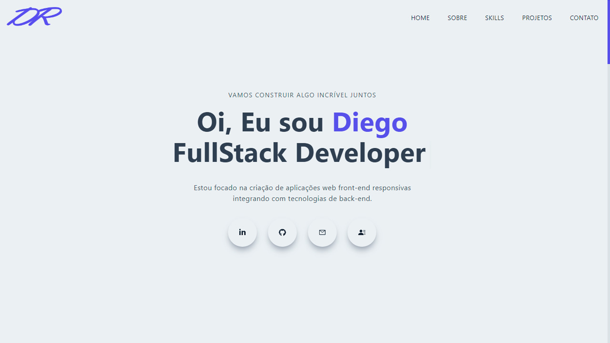

<h1 align="center">
  Meu Portfólio
</h1>

<p align="center">
  <a href="https://www.diegoricardoweb.dev/" target="_blank">
    
  </a>
</p>

## 💻 Projeto

Meu portfolio, falando algumas coisas sobre mim, meus contatos, skills que domino e alguns projetos desenvolvidos.

Dependências usadas no projeto:

-  [NextJS](https://nextjs.org/)
-  [Tailwindcss](https://tailwindcss.com/)
-  [TypeScript](https://www.typescriptlang.org/)
-  [React Hook Form](https://react-hook-form.com/)
-  [Framer Motion](https://www.framer.com/motion/)
-  [React Icons](https://react-icons.github.io/react-icons/)
-  [Swiper](https://swiperjs.com/)
-  [Graphql](https://graphql.org/)
-  [Graph Cms](https://hygraph.com/)
-  [Graphql Code Generator](https://www.the-guild.dev/graphql/codegen)


Também foi adicionado a ferramenta [**ESLint**](https://eslint.org/) e [**Prettier**](https://prettier.io/) para aumentar a produtividade e auxiliar a manter um padrão de código.

## 📥 Instalação e execução

Faça um clone desse repositório e acesse o diretório.

```bash
# Instalando as dependências
$ yarn

# Executanto aplicação
$ yarn dev
```
Abra [http://localhost:3000](http://localhost:3000) em seu browser para ver o resultado.

## Comandos

- `dev`: roda sua aplicação em `localhost:3000`
- `build`: cria a versão de build de produção
- `lint`: roda os linter em todos os componentes e páginas
